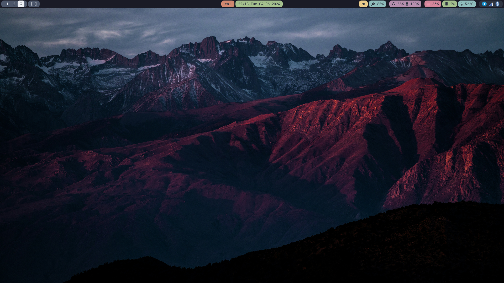
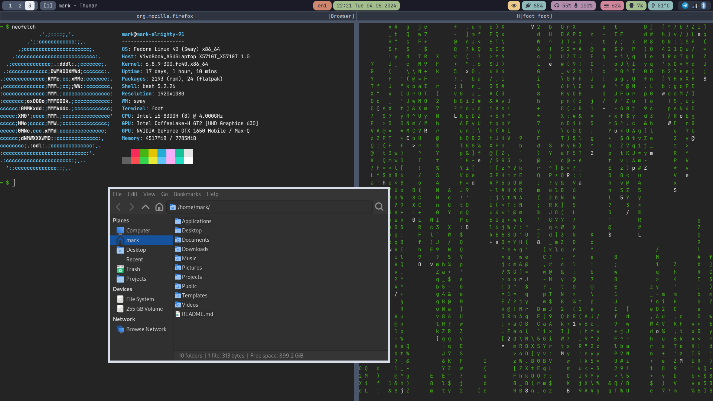

# My personal dotfiles




## Prerequisities

Programs:
* Fish command shell
* Foot terminal
* Sway Wayland compositor
* Waybar status bar
* SwayNC notification center

Resources:
* JetBrains Mono font
* FontAwesome font

Programs to show off:
* neofetch/fastfetch
* cmatrix

## Setup DE

```bash
# Specify the background image
ln -s /path/to/background.jpg ~/Pictures/background
```

## Start DE

```bash
sway
```

Or if you have NVidia GPU:

```bash
sway --unsupported-gpu
```
